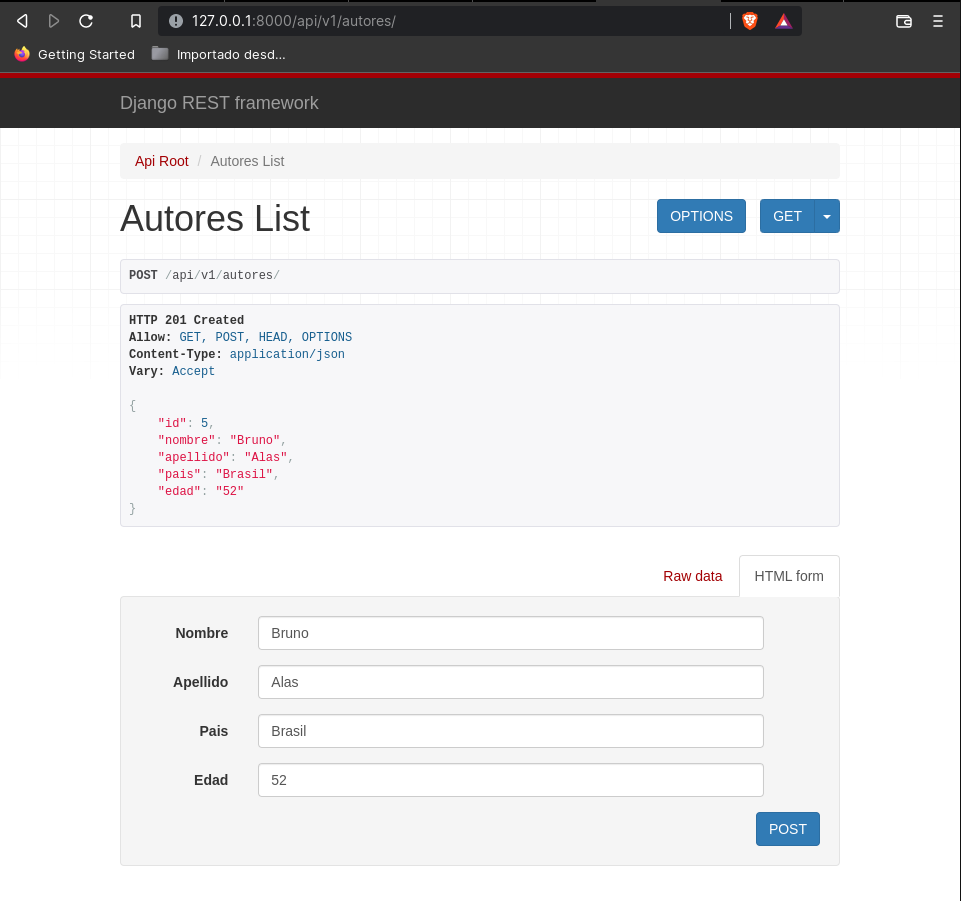

## Ejercicio DE POO aplicando Django Rest Framework

Hacer un diagrama de clases para modelar un portafolio de obras de arte. Cada obra tiene un tipo (escultura, pintura, video,…), uno o más autores, una fecha de creación, un valor estimado. Adicionalmente cada obra tiene asociado un conjunto de fotografías y/o videos para exhibirla en el portafolio. A partir del portafolio se crean exposiciones de las obras en galerías. Cada exposición tiene unas fechas, un lugar y una descripción. Para una exposición se selecciona un conjunto de obras el portafolio que se van a presentar.

**Solucion**

Para esta parte se utilizaron 4 Clases:

1. Clase Autores

2. Clase Obra de Arte

3. Clase Exposicion

4. Clase Portafolio

### Peticion desde Swagger, Postman y Django

1. Autores

Django

* Obtener todos los autores

* Obtener un autor

* Publica un autor

* Actualizar un autor

* Eliminar un autor

Swagger 

* Todas las funcionalidades

Postman

* Obtener todos los autores

* Obtener un autor

* Publica un Autor

* Actualizar un Autor

* Eliminar un Autor

2. Obras de Arte

Django

* Obtener todos las obras

* Obtener una obra

* Publica una obra

* Actualizar una obra

* Eliminar una obra

Swagger 

* Todas las funcionalidades

3. Exposiciones

Django

* Obtener todos las exposiciones

* Obtener una exposicion

* Publica una exposicion

* Actualizar una Exposicion

* Eliminar una Exposicion

Swagger 

* Todas las funcionalidades

4. Portafolio 

Django

* Obtener todos los Portafolios

* Obtener un Portafolios

* Publica un Portafolios

* Actualizar un Portafolios

* Eliminar un Portafolios

Swagger 

* Todas las funcionalidades
